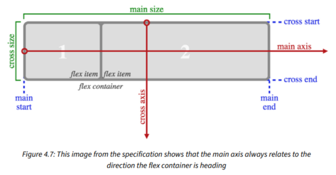

# Chapter 4 - Fluid Layout and Flexbox

## Referencias

[Flex container - w3.org](https://www.w3.org/TR/css-flexbox-1/#flex-containers)
[CSS Box Alignment](https://www.w3.org/TR/css-align-3/)
[Flex Components](https://www.w3.org/TR/css-flexbox-1/#flex-components)

### Fluid Layout

- ***Fluid layout*** são um layouts produzidos com porcentagens.
- Temos o efeito de ***proporcionalidade entre o contexto e o componente***.
- Um calculo basico para transformar layout fixos em layout fluidos é
  - ***target / context = result***
    - O resut sempre será o valor em porcentagem a ser adicionado. Lembrando de correr 2 casas decimais.
    - ***Exemplo***
      - Temos um container de ***960px*** e temos um conteudo de ***200***. Dividiremos 200/960 = 0.20833.... Corremos duas casas decimais e o resultado é ***20.84%***

### Flexbox

- Atualmente existe duas formas poderosas de produzir layout. Quando queremos montar um layout ***em uma direção***, usamos ***flexbox***.
  - Quando utilizamos ***display:flex*** dentro de um container, todos os filhos dele irão virar flex-items

- Flexbox possui 4 caracteristicas: ***direção, alinhamento, ordenação e flexibilidade***.
- Propriedades utilizadas no flex box, são:
  
  - ***Tags combinadas***
    - Podemos combinar ***align-items*** e ***justify-items*** com a tag ***place-items***
    - ***flex-flow*** combina ***flex-direction e flex-wrap*** em uma só tag.
      - ***flex-direction*** determina a direção do main e cross axis
      - ***flex-wrap*** ainda não sei
  - ***inline-flex***
    - Propriedade que permite facilmente atribuir caracteristicas de caixa para elementos inline.

### Propriedades de alinhamento

- ***Entendendo o flex-direction***
  - ***flex-direction*** X ***main-axis***
    - flex-direction: row | row-reverse  X main-axis: horizontal
    - flex-direction: column | column reverse X main-axis: vertical

  - ***flex-direction*** X ***cross-axis***
    - flex-direction: row | row-reverse  X cross-axis: vertical
    - flex-direction: column | column reverse X cross-axis: horizontal

- ***Propriedades***
  - ***align-items***
    - Alinha os items dentro do ***cross-axis*** que depende do flex-direction.

  - ***align-self***
    - Permite que os ***flex-items*** individualmente mudem seus alinhamentos.
  - ***justify-content***
    - Alinha os flex-items dentro do ***main-axis***

- ***A propriedade flex***
  - Normalmente setamos um width para os ***flex-items*** dentro de um ***flex-container***, porem podemos deixar a largura dos ***flex-items*** como flexiveis tambem utilizando a propriedade ***flex***
  - ***flex*** é a união de 3 propriedades: ***flex-grow***, ***flex-shrink*** e ***flex-basis***
    - ***flex-grow***
      - é a quantidade de espaço que o ***flex-item*** pode preencher em relação aos outros flex-items quando tem espaço disponivel
    - ***flex-shrink***
      - é a quantidade de espaço que o ***flex-item*** pode diminuir em relação ao ouros flex-items.
    - ***flex-basis***
      - é uma propriedade que funciona como ***min-width***. Ter cuidado enquanto setar o flex-shrink e o flex-basis pra eles não se analarem.

- ***order***
  - nos ***flex-items*** podemos setar a propriedade ***order*** que ira declarar qual posição esse item irá ficar na fila dos items flex.
  - setar o valor -1 para um item o fará ser o primeiro da lista.
  - pa ter um melhor controle é melhor declarar separadamente as ordem de cada ***flex-item***
    - exemplo
      - order:1 , order: 2, etc...
- ***flex-flow***
  - essa propriedade é um atalho para outras duas propriedades do flex que é o ***flex-direction*** e ***flex-wrap***.

- ***Wrapping elementos com flex***
  - Normalmente os ***flex-items*** possuem a tendencia de caber no container que estão. Porem caso a dimensão desses ***flex-items*** ultrapasse a largura do container eles irão sobressair o mesmo. Sendo assim existe uma propriedade que ira ajudar a quebrar esse overflow existem no container. O ***flex-wrap***
